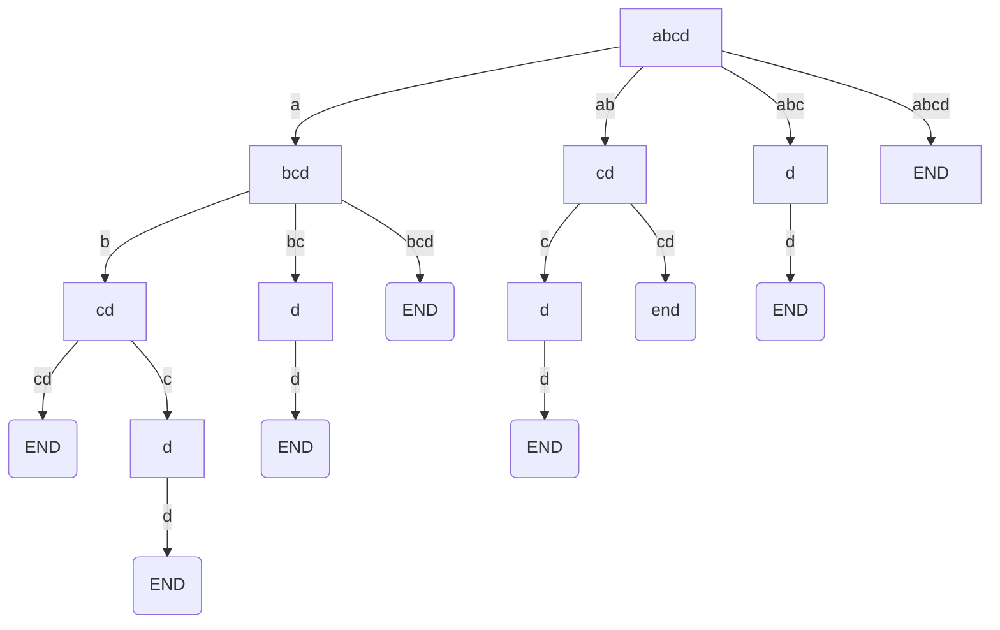

```mermaid
flowchart TD

1[abcd]--a-->2[bcd]
1--ab-->2.1[cd]--c-->3.3[d]--d-->4.3(END)
1--abc-->2.2[d]
1--abcd-->2.3[END]
2--b-->3[cd]--cd-->3.6(END)
2--bc-->3.1[d]--d-->4.1(END)
2--bcd-->3.2(END)

2.1--cd-->3.7(end)

2.2--d-->3.8(END)
3--c-->4[d]
4--d-->5(END)
```